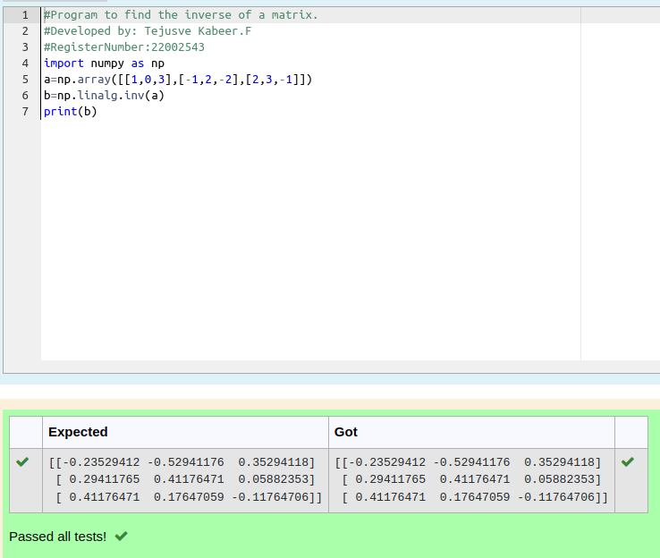

# INVERSE-OF-A-MATRIX

## Aim:

To write a python program to find the inverse of a matrix

## Equipment’s required:

1. 	Hardware – PCs
2. 	Anaconda – Python 3.7 Installation / Moodle-Code Runner

## Algorithm:

### Step1 : 
initialize the program with import numpy as np

### Step 2: 
create array using np.array()

### Step 3: 
inverse can be found using np.linalg.inv() 

### Step 4: 
End of the program

## Program:
```python
#Program to find the inverse of a matrix.
#Developed by: Tejusve Kabeer.F
#RegisterNumber:22002543
import numpy as np
a=np.array([[1,0,3],[-1,2,-2],[2,3,-1]])
b=np.linalg.inv(a)
print(b)
```

## Output:

## Result:

Thus the inverse of given matrix is successfully solved using python program

